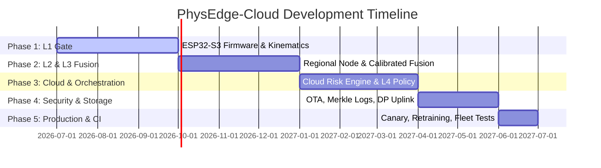

# Development Roadmap and Verification Plan

This document outlines the development lifecycle, phases of implementation, verification targets, and performance testing protocols for the PhysEdge-Cloud platform.

---

## 1. Development Phases & Milestones

The project is structured into 5 iterative phases over a 12-month development timeline.



### Phase 1: Layer 1 Embedded Kinematics (Months 1–3)
*   **Deliverables:** ESP32-S3 firmware containing fixed-point optical flow, perspective homography calibration routines, and z-score jerk surprise thresholds.
*   **Milestone 1.1:** Successfully run optical flow at $\ge 25 \text{ FPS}$ on ESP32-S3 within a $200 \text{ KB}$ RAM footprint.
*   **Milestone 1.2:** Validate metric conversion ($v_m, a_m, j_m$) using ground-truth physical velocities.

### Phase 2: Layer 2 Regional Validation & Fusion (Months 4–6)
*   **Deliverables:** NVIDIA Jetson implementation of YOLOv8n and BlazePose, and recursive log-odds fusion calculations.
*   **Milestone 2.1:** Temperature-calibrated probabilities for YOLOv8n outputs achieving Expected Calibration Error (ECE) $< 0.05$.
*   **Milestone 2.2:** Establish communication channel executing sub-$150 \text{ ms}$ regional validation times.

### Phase 3: Layer 3 & 4 Cloud Reasoning & Cost Control (Months 7–9)
*   **Deliverables:** Cloud Graph Interaction Model, Memory Autoencoder, and adaptive orchestration controllers.
*   **Milestone 3.1:** Conformal prediction intervals achieving $95\%$ coverage guarantees on non-stationary datasets.
*   **Milestone 3.2:** Execute Lagrangian compute routing proving $\ge 40\%$ reduction in cloud expenses compared to baseline cloud-only pipelines.

### Phase 4: Governance, Security, and Compliance (Months 10–11)
*   **Deliverables:** OTA updater system, Merkle log hash-chain storage, and coordinate coarsening DP.
*   **Milestone 4.1:** Verify secure boot integrity on ESP32, rejecting altered or unsigned firmware loads.
*   **Milestone 4.2:** Re-identification threat validation: evaluate linkage attack failure rates under coarsening configurations.

### Phase 5: Production and Canary Integration (Month 12)
*   **Deliverables:** Canary release controller, automatic rollback scripts, and fleet monitoring dashboards.
*   **Milestone 5.1:** Simulate rollback events to verify SPRT rollback execution within 15 minutes of trigger injection.

---

## 2. Verification Protocol & Testing Rigs

### Automated Testing Rig Configuration

We construct an automated simulation rig in the test suite to validate physics thresholds and pipeline escalations.

*   **Simulator Tool:** Blender-based physical video generator producing camera views at varying tilt and height angles.
*   **Kinematic Verification Command:** Run tests to measure homography mapping errors:
    ```powershell
    python -m unittest tests/test_kinematics.py
    ```
*   **Performance Benchmarking Command:** Evaluate frame AUC and latency profile under load:
    ```powershell
    python scripts/benchmark_pipeline.py --dataset ucf-crime --config configs/production.yaml
    ```

### Benchmark Datasets for Evaluation
Development progress is validated against standard public benchmarks:
*   **UCF-Crime / XD-Violence:** Evaluates overall detection accuracy (Frame-level AUC/AP).
*   **ShanghaiTech / CUHK Avenue:** Evaluates scene anomaly generalization capabilities.
*   **UBnormal:** Validates open-set performance under synthetic drift.

---

## 3. Key Performance Indicators (KPIs)

To declare the system production-ready, the pipeline must satisfy the following KPI bounds under stress testing:

| Metric | Target KPI Bound | Verification Method |
| :--- | :--- | :--- |
| **Edge Compute Frame Rate** | $\ge 25 \text{ FPS}$ (at $160 \times 120$ resolution) | Measured execution time on ESP32-S3. |
| **Power Consumption** | $\le 800 \text{ mW}$ average edge draw | INA219 current sensor logging. |
| **False Alarms Rate** | $\le 0.05 \text{ per camera-hour}$ | Evaluated on 50-camera deployment set. |
| **Detection Latency** | $\le 1200 \text{ ms}$ (event occurrence $\rightarrow$ Cloud alarm) | Network-timestamp telemetry logs. |
| **Empirical Coverage** | $\ge 1 - \alpha$ ($95\%$ for $\alpha = 0.05$) | Conformal prediction calibration validation. |
| **Bandwidth Savings** | $\ge 90\%$ reduction vs raw stream streaming | Wireshark telemetry throughput audits. |
