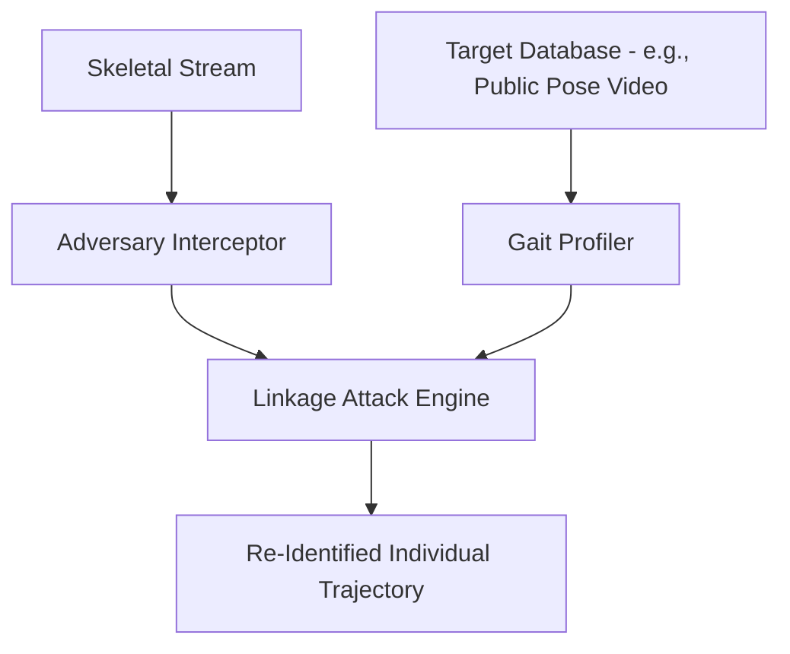

# Security and Privacy Specifications: PhysEdge-Cloud

This document establishes the official security architecture, privacy protection boundaries, threat mitigation protocols, and forensic audit procedures for the PhysEdge-Cloud system.

---

## 1. Zero-PII Egress Contract

The system enforces a **Zero-PII Egress Contract** at the network boundary. No raw video frames or high-resolution images are allowed to leave the local Regional Edge Node boundary. 

### Data Flow Enforcement Matrix

| Data Classification | Egress Authorized | Enforced Transit Layer | Privacy Protection |
| :--- | :--- | :--- | :--- |
| **Raw Video Frames** | **NO** | Camera $\rightarrow$ Regional Node only | Bound to RAM Ring Buffer; never written to local disk. |
| **Skeletal Pose Matrices** | **YES** | Regional Node $\rightarrow$ Cloud Engine | $2D/3D$ joint floats with no facial textures. |
| **Kinematic Scalars** | **YES** | Edge $\rightarrow$ Regional $\rightarrow$ Cloud | Aggregated metric velocity, acceleration, and jerk. |
| **Embeddings** | **YES** | Regional Node $\rightarrow$ Cloud Engine | $256$-dimensional feature vectors. |

---

## 2. Re-Identification Threat Modeling

While skeletal pose vectors strip visual face markers, they remain susceptible to **Linkage Attacks** and **Gait Signature Matching**. If an adversary intercepts coordinate vectors, they may reconstruct individual identity by comparing kinematics against known target databases.

### Attack Vector Analysis

### Mitigations: Differential Privacy & Coarsening
To satisfy the Zero-PII claim, the following mechanisms must be enabled during transmission above the Regional boundary:
1.  **Coordinate Coarsening:** Lowers resolution of Joint $x,y$ values to a grid of $64 \times 64$ coordinates, degrading micro-expression postures while preserving macro-kinematic anomalies (falls, violence).
2.  **Differential Privacy Noise Injection:** Adds calibrated Laplace noise $\eta \sim \text{Lap}(0, \frac{\Delta f}{\epsilon})$ to the joint coordinates:
    $$x_{\text{private}} = x + \eta$$
    where $\epsilon$ represents the privacy budget allocated per camera stream.

---

## 3. Threat Mitigation Matrix

| Threat Vector | Source | Target | Impact | Mitigation Strategy |
| :--- | :--- | :--- | :--- | :--- |
| **Firmware Downgrade Attack** | Man-In-The-Middle / Physical | ESP32-S3 Edge Gate | Executing old, vulnerable firmware versions. | **Anti-rollback Counter:** Hardware-fused monotonic counters inside ESP32 OTP memory reject lower version revisions. |
| **Model Poisoning** | Network Intrusion | Regional Node / Cloud | False negative anomalies or adversarial triggers. | **ECDSA Weight Signing:** All model weights must be signed using private developer keys. The system verifies certificates prior to execution. |
| **Feedback Channel Poisoning** | Network Intrusion | Negative Constraint Loop | Disabling edge detectors via false constraints. | **Rate-Limiting & Outlier Rejection:** Constraint adjustments are capped at $\pm 25\%$ of current thresholds per 24 hours. |

---

## 4. Forensic Hash-Chain Audit System (Layer 6)

For court-admissible evidence validation, Tier B event clips are archived in a tamper-evident **Merkle Logging / Hash-Chaining** system.

Each event record block $B_i$ contains:
*   $\text{Hash}(B_{i-1})$: Prev block cryptographic hash.
*   $\text{ClipData}$: Cryptographic hash of the video snippet.
*   $\text{TriggerProvenance}$: Kinematic metrics ($v_m, a_m, j_m$) initiating the wake-gate.
*   $\text{ModelHash}$: Signature hash of the executing model version.

$$B_i = \text{SHA256}\Big(\text{Hash}(B_{i-1}) \mathbin{\Vert} \text{Hash}(\text{ClipData}) \mathbin{\Vert} \text{TriggerProvenance} \mathbin{\Vert} \text{ModelHash}\Big)$$

Any modification to historical video recordings breaks the hash chain, rendering tampering instantly visible to auditors.
